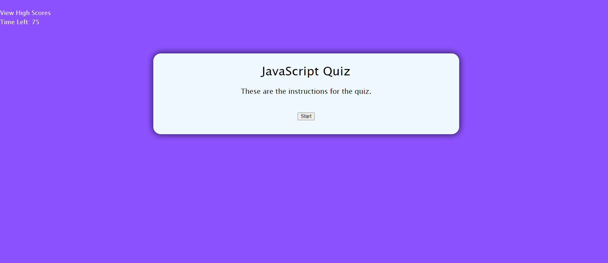

# JavaScript Timed Quiz

##Description

The goal of this project is to build a timed coding quiz with multiple choice questions. The clock will subtract 15 seconds if you answer incorrectly. It is created with HTML and CSS and is powered with JavaScript. Scores will be saved in local storage and then added to a different web page called 'Highscores'. Scores should be in order from highest to lowest.

## Link to Live Webpage

https://rylee94.github.io/javascript-quiz-2/

## Link to Repository
https://github.com/Rylee94/javascript-quiz-2

